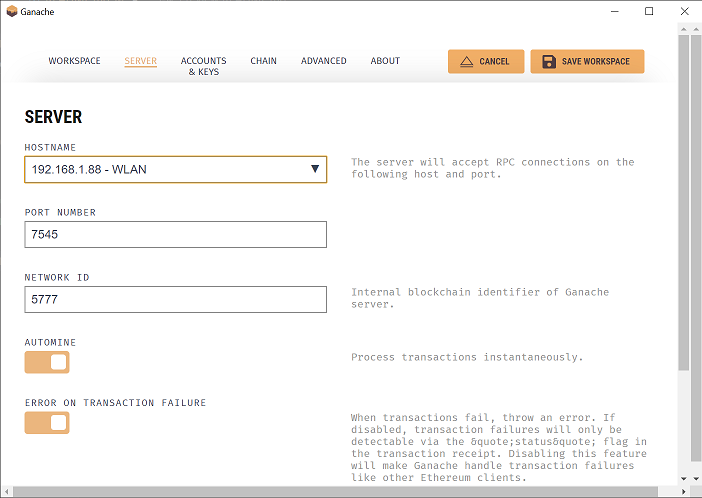

# IBES Blockchain

## _Local Blockchain Application_

This is the blockchain part of IBES. This Prototype is intended to run locally and requires

- [node]
- [truffle]
- [Ganache]

## How to run

After installing all dependencies, we have to configure the local blockchain we use for our prototype. In order to do so we use Ganache GUI

### Ganache Setup

- open Ganache GUI and select the option "new workspace ethereum".
- in the "Workspace" tab choose the _Add project_ button and provide the `truffle-config.js` (IBES_Blockchain/truffle-config.js)
- switch to the "Server" tab and change the hostname from `localhost` to your local network and select your IP-address- a dropdown option should be available
  
- don't forget to save your configuration :)

### Truffle Setup

We use truffle to deploy our smart contracts to the blockchain run by ganache. In order to so we have to connect to the local blockchain and start a truffle console:

- start by changing the `truffle-config.js`: scroll down to the "development" network and change the host address to your IP (same as in the "Server"-step of Ganache)
- NOTE: we only have to deploy our smart contracts once initially and after every smart-contract change.
  To deploy the contracts start a truffle console:

```sh
cd IBES_Blockchain
truffle console
```

- In the appearing truffle console deploy the smart contracts to the local Ganache blockchain

```sh
migrate --reset
```

## Smart Contracts

Right now there are 3 smart contracts included in the prototype. They all share a "submit" function to provide data to them. The submitted data is required in the following format:

```
(string timestamp, int measured_value, string geolocation)
```

[//]: # "Reference Links"
[node]: https://nodejs.org/en/
[truffle]: https://www.trufflesuite.com/truffler
[ganache]: https://www.trufflesuite.com/ganache
[//]: # "Image Links"
